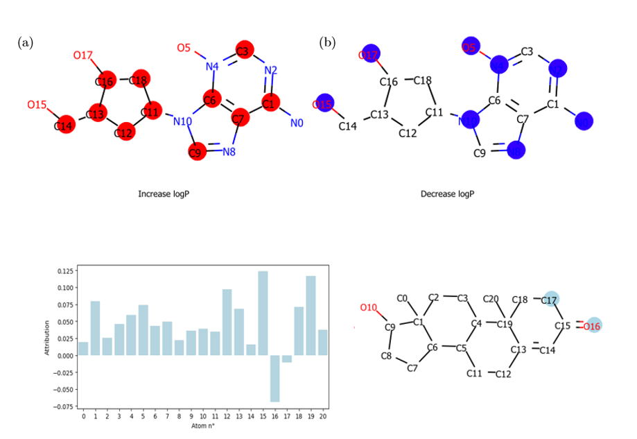

# InterpretGCN

Integrated Gradients and Attention coefficients computation & visualization to explain molecular GCNs on various tasks.

edge_and_nodes_map.pickle contains dictionaries mapping possible values for edge/node features to their index in one-hot encoding. 
They were built after parsing the CHEMBL cleaned dataset. May need to be rebuilt for a new dataset.

